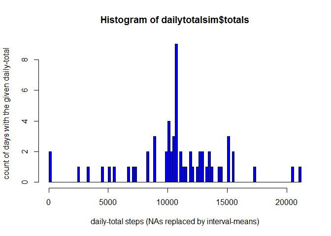

# Project Assignment 1
Mark Sandstrom  
2016-01-09  
Reproducing results on analyzing steps taken by a volunteer at different times of day
---
**1. Code for reading in the dataset and/or processing the data**

To reproduce our results, first copy and unzip the measurement data file activity.csv from https://d396qusza40orc.cloudfront.net/repdata%2Fdata%2Factivity.zip to the R working directory. Next, read it into a data frame, and omit the rows with no values in in the measurement column `steps`:

```r
library(plyr)
dfwna=read.csv('activity.csv')
df=subset(dfwna,steps!='NA')
any(is.na(df))
```

```
## [1] FALSE
```

To view basic aspects of the measurement data frame `df`:

```r
str(df)
```

```
## 'data.frame':	15264 obs. of  3 variables:
##  $ steps   : int  0 0 0 0 0 0 0 0 0 0 ...
##  $ date    : Factor w/ 61 levels "2012-10-01","2012-10-02",..: 2 2 2 2 2 2 2 2 2 2 ...
##  $ interval: int  0 5 10 15 20 25 30 35 40 45 ...
```

```r
summary(df)
```

```
##      steps                date          interval     
##  Min.   :  0.00   2012-10-02:  288   Min.   :   0.0  
##  1st Qu.:  0.00   2012-10-03:  288   1st Qu.: 588.8  
##  Median :  0.00   2012-10-04:  288   Median :1177.5  
##  Mean   : 37.38   2012-10-05:  288   Mean   :1177.5  
##  3rd Qu.: 12.00   2012-10-06:  288   3rd Qu.:1766.2  
##  Max.   :806.00   2012-10-07:  288   Max.   :2355.0  
##                   (Other)   :13536
```

The measurement `steps` is simply an integer count of (e.g. walking) steps taken by the volunteer wearing the monitoring system on the `date` and the observation `interval` by their respective columns, where the value of `interval` is an identification of a 5-minute interval during any given `date`.

**2. Histogram of the total number of steps taken each day**

To histogram the daily totals of the `steps` with measurement intervals with missing values (NAs) for `steps` ignored:

```r
dailytotals=ddply(df, c('date'), summarise, totals=sum(steps))
hist(dailytotals$totals, 100, col='green', xlab='daily-totals steps (ingoring NAs)', ylab='count of days with the given daily-total')
```

 

**3. Mean and median number of steps taken each day**

To report the daily mean and median of `steps` taken, with intervals with missing `steps` omitted:

```r
summary(dailytotals$totals)
```

```
##    Min. 1st Qu.  Median    Mean 3rd Qu.    Max. 
##      41    8841   10760   10770   13290   21190
```

**4. Time series plot of the average number of steps taken**

To see any pattern in the daily averages of `steps`:

```r
dailyaves=ddply(df, c('date'), summarise, mean=mean(steps))
plot(dailyaves$date, dailyaves$mean, xlab='date', ylab='daily averages of steps for 5-minute intervals (omitting NAs)')
lines(dailyaves$date, dailyaves$mean)
```

 

**5. The 5-minute interval that, on average, contains the maximum number of steps**

To see any pattern in the per-5-minute-interval averages of `steps` across the dates:

```r
intervalaves=ddply(df, c('interval'), summarise, mean=mean(steps))
plot(intervalaves$interval, intervalaves$mean, type='l', col='red', xlab='interval', ylab='mean steps')
```

 

The 5-minute `interval` with maximum `steps` in average across the `dates`:

```r
maxi=subset(intervalaves, mean==max(intervalaves$mean))
maxi
```

```
##     interval     mean
## 104      835 206.1698
```

**6. Code to describe and show a strategy for imputing missing data**

To replase the missing values for `steps` by the average value for their respective intervals:

```r
dfim=dfwna
dfim$steps[is.na(dfim$steps)] = with(dfim, ave(steps, interval, FUN = function(x) mean(x, na.rm=T)))[is.na(dfim$steps)]
any(is.na(dfim))
```

```
## [1] FALSE
```

**7. Histogram of the total number of steps taken each day after missing values are imputed**

To histogram the daily totals of the `steps` with measurement intervals after missing values (NAs) for `steps` imputed per above:

```r
dailytotalsim=ddply(dfim, c('date'), summarise, totals=sum(steps))
hist(dailytotalsim$totals, 100, col='blue', xlab='daily-total steps (NAs replaced by interval-means)', ylab='count of days with the given daily-total')
```

 

To see if the daily mean and median of `steps` taken have changed (from point 3 above) after imputing missing `steps`:

```r
summary(dailytotalsim$totals)
```

```
##    Min. 1st Qu.  Median    Mean 3rd Qu.    Max. 
##      41    9819   10770   10770   12810   21190
```

**8. Panel plot comparing the average number of steps taken per 5-minute interval across weekdays and weekends**

To see if there is a difference in per-interval-averages of steps taken between weekdays (Mon-Fri) and weekends (Sat-Sun):

```r
dfwd=mutate(df, wd=timeDate::isWeekday(date))
dfwk=subset(dfwd,wd==T)
dfwe=subset(dfwd,wd==F)
par(mfrow=c(2,1))
intervalaves=ddply(dfwk, c('interval'), summarise, mean=mean(steps))
plot(intervalaves$interval, intervalaves$mean, 'l', col='blue', xlab='interval', ylab='Mon-Fri mean steps',lwd=3)
intervalaves=ddply(dfwe, c('interval'), summarise, mean=mean(steps))
plot(intervalaves$interval, intervalaves$mean, 'l', col='green', xlab='interval', ylab='Sat-Sun mean steps',lwd=3)
```

 

